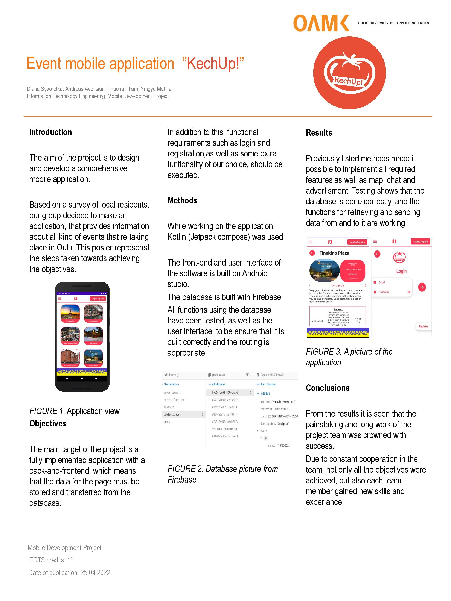

# KechUp Mobile Application

### Group members: 
* Diana Syvorotka （diana-sy）
* Phuong Pham  （phuongpham20012001）
* Andreas Avetisian （AndreasAvetisian）
* Yingyu Mattila （C520S）

### Introduction
The aim of the project is to design and develop a comprehensive mobile application.
Based on a survey of local residents,our group decided to make anapplication, that provides informationabout all kind of events that re takingplace in Oulu. This poster represenst the steps taken towards achieving the objectives.

### Objectives
The main target of the project is a fully implemented application with a back-and-frontend, which means that the data for the page must be stored and transferred from the database.
In addition to this, functional requirements such as login and registration, as well as some extra funtionality of our choice, should be executed.

### Methods
While working on the application Kotlin (Jetpack compose) was used The front-end and user interface of the software is built on Android studio.
The database is built with Firebase. All functions using the database have been tested, as well as the user interface, to be ensure that it is built correctly and the routing is appropriate.

### Poster

